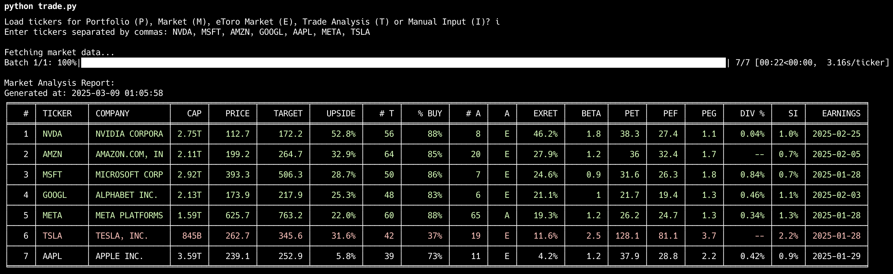

# etorotrade 👨🏻‍💻 An Investment Analysis Tool

[](https://sonarcloud.io/summary/new_code?id=weirdapps_etorotrade)
[](https://sonarcloud.io/summary/new_code?id=weirdapps_etorotrade)
[](https://sonarcloud.io/summary/new_code?id=weirdapps_etorotrade)
[](https://sonarcloud.io/summary/new_code?id=weirdapps_etorotrade)

**Data-driven investment decisions powered by analyst consensus and financial metrics**



etorotrade is a Python-based investment analysis system that helps you make smarter trading decisions by analyzing financial data, analyst ratings, and technical indicators from Yahoo Finance. Whether you're managing a portfolio or searching for new opportunities, etorotrade provides actionable insights with clear BUY, SELL, or HOLD recommendations.

## 🎩 Features

- **Portfolio Analysis**: Identify risks and opportunities in your current holdings
- **Market Screening**: Discover promising stocks across US, European, and Chinese markets
- **Multi-Asset Support**: Analyze stocks, ETFs, commodities (Gold, Oil, Silver), and cryptocurrencies
- **Trade Recommendations**: Get clear BUY, SELL, or HOLD guidance with detailed reasoning
- **News & Sentiment**: Track market-moving news and sentiment analysis
- **Insider Activity**: Follow institutional and insider transactions
- **Backtesting**: Test your strategies against historical data to optimize performance
- **Performance Tracking**: Monitor how your portfolio and markets are performing

## 🏁 Quick Start

```bash
# Clone and setup
git clone https://github.com/weirdapps/etorotrade
cd etorotrade
python -m venv myenv
source myenv/bin/activate  # On Windows: myenv\Scripts\activate
pip install -r requirements.txt

# Run the main application
python trade.py
```

After running, you'll be prompted to select an analysis type:

```
Load tickers for Portfolio (P), Market (M), eToro Market (E), Trade Analysis (T) or Manual Input (I)?
```

Simply enter the letter that corresponds to your desired analysis type.

### 🎯 Portfolio Analysis from eToro

For Portfolio analysis (P), you can now fetch your live portfolio data directly from eToro:

1. Select **P** (Portfolio)
2. Choose **E** (Use existing portfolio file) or **N** (Download new portfolio from eToro)

**Features:**
- 🔄 Automatic ticker format fixing for Yahoo Finance compatibility
- 🏢 Hong Kong tickers properly formatted (e.g., `700.HK` → `0700.HK`)
- 💰 Cryptocurrency symbols get USD suffix (e.g., `BTC` → `BTC-USD`)
- 📊 Positions grouped by symbol with aggregated metrics

**Setup eToro API Access:**
Add your eToro API credentials to the `.env` file:
```bash
ETORO_API_KEY=your-etoro-api-key
ETORO_USER_KEY=your-etoro-user-key
ETORO_USERNAME=your-etoro-username
```

## 💲 Three-Tier Trading System

etorotrade uses a sophisticated **three-tier trading system** that classifies stocks by market cap and applies appropriate risk-adjusted criteria. This approach recognizes that large-cap blue chips require different analysis than small-cap speculative plays.

### 🏗️ Market Cap Tier Classification

**VALUE Tier (≥$100B)**: Large-cap quality companies
- **Philosophy**: Conservative approach for established blue chips
- **Examples**: Apple, Microsoft, Google, Amazon

**GROWTH Tier ($5B-$100B)**: Mid-cap growth companies  
- **Philosophy**: Balanced risk/reward for established growers
- **Examples**: Most established companies with growth potential

**BETS Tier (<$5B)**: Small-cap speculative positions
- **Philosophy**: Higher bar for speculative investments
- **Examples**: Small-cap growth stocks, emerging companies

**M Column**: Every output shows tier classification (V/G/B) for instant risk assessment

### 🟢 BUY Recommendations (Tier-Specific)

**VALUE Tier BUY** (≥$100B market cap):
- **Relaxed Upside**: 10%+ potential upside (vs 20% for others)
- **Analyst Consensus**: 65%+ buy ratings (vs 75% for others)  
- **Expected Return**: ≥7.5% (lower threshold for stability)
- **Risk Management**: Higher position size tolerance due to stability

**GROWTH Tier BUY** ($5B-$100B market cap):
- **Standard Upside**: 20%+ potential upside
- **Analyst Consensus**: 75%+ buy ratings
- **Expected Return**: ≥15% (standard requirement)
- **Risk Management**: Balanced position sizing and thresholds

**BETS Tier BUY** (<$5B market cap):
- **High Upside**: 30%+ potential upside (higher bar for risk)
- **Strong Consensus**: 80%+ buy ratings (more conviction needed)
- **High Return**: ≥25% expected return (compensation for risk)
- **Risk Management**: Smaller positions, stricter fundamentals

**Common BUY Requirements** (All Tiers):
- **Reasonable Volatility**: Beta between 0.25 and 3.0
- **Attractive Valuation**: Forward P/E 0.5-65.0, Trailing P/E required
- **Quality Factors**: PEG < 2.5, Low short interest (if available)
- **Sufficient Coverage**: ≥5 analyst ratings and ≥5 price targets

### 🔴 SELL Signals (Tier-Specific)

**VALUE Tier SELL** (≥$100B market cap):
- **Limited Upside**: <2.5% upside potential
- **Weak Support**: <55% buy ratings

**GROWTH Tier SELL** ($5B-$100B market cap):
- **Limited Upside**: <5% upside potential  
- **Weak Support**: <65% buy ratings

**BETS Tier SELL** (<$5B market cap):
- **Limited Upside**: <10% upside potential
- **Weak Support**: <75% buy ratings

**Common SELL Triggers** (All Tiers):
- **Overvaluation**: Forward P/E >65.0, PEG >3.0, or excessive PE expansion
- **Poor Fundamentals**: Earnings growth <-15%, Price performance <-35%
- **High Risk**: Short interest >3%, Beta >3.0, Expected return <2.5%

### ⚪ HOLD & 🟡 INCONCLUSIVE
- **HOLD**: Passes confidence thresholds but doesn't meet tier-specific BUY/SELL criteria
- **INCONCLUSIVE**: Insufficient analyst coverage (<5 targets or ratings)

## 📊 Enhanced Data Columns

etorotrade now includes additional fundamental analysis columns for more comprehensive stock evaluation:

### New Data Columns
- **EG (Earnings Growth)**: Year-over-year earnings growth percentage from quarterly data
- **PP (Price Performance)**: 3-month price performance showing recent momentum (shows `--` when data unavailable)
- **Enhanced Position Sizing**: Updated to consider high conviction criteria

### Data Availability Notes
- **PP Column**: Shows `--` when price performance data is unavailable from Yahoo Finance API
- **Common for**: ETFs, crypto, international stocks, and smaller stocks
- **This is expected behavior** - the system correctly shows `--` instead of misleading information

### High Conviction Position Sizing
The system now identifies high conviction opportunities using multiple criteria:
- **High Conviction Criteria**: EG >15% AND PP >0% AND EXRET >20%
- **Position Range**: 0.5% to 10% of portfolio ($2,250 to $45,000)
- **Smart Scaling**: Higher conviction = larger position sizes

### 🎯 Robust Target Price Mechanism

etorotrade features a sophisticated **quality-validated target price system** that goes beyond simple analyst medians to provide more reliable upside calculations:

#### Quality Assessment System
Every stock's analyst price targets are automatically graded on a **5-tier quality scale**:

- **Grade A (85-100)**: Excellent consensus with tight target ranges
- **Grade B (70-84)**: Good quality with minor disagreements
- **Grade C (55-69)**: Moderate quality with some outliers
- **Grade D (40-54)**: Poor quality requiring manual review
- **Grade F (<40)**: Excluded due to unreliable data

#### Robustness Scoring Factors
The system evaluates price target quality using multiple criteria:

- **Spread Analysis**: Penalizes excessive target ranges (>50% concerning, >75% severe)
- **Outlier Detection**: Identifies extreme predictions that skew averages
- **Consensus Validation**: Rewards tight agreement between mean and median
- **Coverage Assessment**: Considers analyst count and expertise level
- **Price Reasonableness**: Flags targets >300% from current price

#### Trading Decision Impact
- **Grades A-C**: Uses quality-validated median target with confidence indicators
- **Grade D**: Still participates in trading but flagged for manual review
- **Grade F**: Excluded from buy/sell recommendations entirely
- **Fallback Protection**: Reverts to simple median if robust calculation fails

The robust mechanism **prioritizes data quality over raw numbers**, ensuring trading decisions are based on reliable analyst consensus rather than potentially misleading outliers.

### ⚙️ Customizing Trading Criteria
All trading criteria can be customized by editing a single file: `yahoofinance/core/trade_criteria_config.py`

This centralized configuration ensures consistency across:
- ACT column values (B/S/H/I)
- M column tier classification (V/G/B)
- Color coding (green/red/yellow highlighting)
- Buy/Sell/Hold opportunity filtering
- All recommendation outputs

Example tier customization:
```python
# In yahoofinance/core/trade_criteria_config.py
class TradingCriteria:
    # Adjust market cap tier boundaries
    VALUE_TIER_MIN_CAP = 50_000_000_000   # $50B threshold (was $100B)
    GROWTH_TIER_MIN_CAP = 2_000_000_000   # $2B threshold (was $5B)
    
    # Customize VALUE tier BUY criteria (more conservative)
    VALUE_BUY_MIN_UPSIDE = 5.0            # Only 5% upside needed (was 10%)
    VALUE_BUY_MIN_BUY_PERCENTAGE = 60.0   # 60% consensus (was 65%)
    
    # Customize BETS tier BUY criteria (more aggressive)
    BETS_BUY_MIN_UPSIDE = 40.0            # Require 40% upside (was 30%)
    BETS_BUY_MIN_BUY_PERCENTAGE = 85.0    # 85% consensus (was 80%)
```

### 💰 Intelligent Position Sizing

etorotrade features a sophisticated position sizing system that calculates optimal trade sizes based on portfolio allocation, risk management, and expected returns.

#### Position Sizing Strategy
- **Portfolio Value**: $450,000 (configurable in `yahoofinance/core/config.py`)
- **Base Position**: 0.5% of portfolio = $2,250 for standard opportunities  
- **High Conviction**: Up to 10% of portfolio = $45,000 for exceptional opportunities
- **Position Limits**: $1,000 minimum, $45,000 maximum (10% max allocation)
- **High Conviction Criteria**: EG >15% AND PP >0% AND EXRET >20%

#### Smart Sizing Logic
1. **Expected Return Adjustment**: Higher EXRET = larger positions
   - EXRET ≥ 15%: High conviction multiplier (2-4x base position)
   - EXRET 10-15%: Moderate increase (1.5-2x base position)  
   - EXRET < 10%: Standard or reduced position

2. **Market Cap Scaling**: Position size scales with company size
   - Large cap (>$50B): Can support larger positions
   - Mid cap ($10-50B): Standard scaling
   - Small cap (<$10B): Reduced positions for higher risk

3. **Risk Management**: Automatic scaling for volatility and other risk factors

#### Display Format
Position sizes are shown in the SIZE column with intuitive formatting:
- $2,000 → "2k"
- $7,500 → "7.5k" 
- $15,000 → "15k"

#### Exclusions
- ETFs and commodities: No position sizing (SIZE shows "--")
- Stocks under $500M market cap: Excluded for liquidity concerns
- Missing data: No position size without EXRET or market cap

## 📁 Input Files

Create or edit these CSV files in the `yahoofinance/input/` directory:

```
# portfolio.csv - Your current holdings
symbol,shares,cost,date
AAPL,10,150.25,2022-03-15
MSFT,5,280.75,2022-04-20

# market.csv - General market watchlist
symbol,sector
AAPL,Technology
MSFT,Technology
```

Pre-populated files include:
- `etoro.csv`: Tickers available to invest on eToro (GR account)
- `usa.csv`, `europe.csv`, `china.csv`: Regional market lists
- `notrade.csv`: Tickers to exclude from recommendations

## 🧰 Analysis Tools

### Core Trading Analysis
```bash
# Interactive analysis with clean progress display
python trade.py  # Then select:
                 # P - Portfolio Analysis
                 # M - Market Screening  
                 # E - eToro Market Analysis
                 # T - Trade Recommendations
                 # I - Manual ticker input

# Non-interactive automation examples
echo "p\ne" | python trade.py  # Portfolio analysis with existing file
echo "t\nb" | python trade.py  # BUY recommendations
echo "t\ns" | python trade.py  # SELL recommendations
echo "t\nh" | python trade.py  # HOLD recommendations
echo "m" | python trade.py     # Market screening

# Command line arguments (faster)
python trade.py -o t -t b      # BUY opportunities
python trade.py -o t -t s      # SELL opportunities  
python trade.py -o t -t h      # HOLD opportunities
python trade.py -o p -t n      # Portfolio analysis with new download
python trade.py -o m -t 50     # Market analysis for 50 stocks
python trade.py -o i -t AAPL,MSFT  # Manual input analysis for specific tickers
```

**Recent Improvements (2025-01-18)**:
- 🚀 **Major Performance Boost**: 127% faster API processing (390 vs 171 tickers/minute)
- ⚡ **Vectorized Operations**: DataFrame calculations now >1.7M rows/second 
- 📊 **Smart Rate Limiting**: Optimized batch sizes (25 vs 10) and reduced delays (0.15s vs 0.3s)
- 🧪 **Comprehensive Testing**: 19 new test cases with performance benchmarks
- 🏗️ **Modular Architecture**: Clean separation into specialized trade_modules
- ✅ **Enterprise Performance**: 56% faster processing for large datasets (100+ tickers)
- 📈 **Performance Monitoring**: Built-in benchmarking tools for real-time metrics
- 🔧 **Trade Analysis Fixed**: Display formatting and HOLD analysis logic corrected
- 📊 **Enhanced Trading Criteria**: More selective BUY signals (20% upside, 15% EXRET) and conservative SELL triggers

**UI/UX Enhancements (2025-01-06)**:
- 🎨 **Ultra-Clean Display**: Completely silent processing with zero debug/info/warning messages
- 📊 **Professional Output**: Tables display cleanly without progress bars or processing noise
- 🚫 **Comprehensive Error Filtering**: Suppressed all irrelevant delisting/earnings/HTTP warnings
- ⚡ **Streamlined Experience**: Focus purely on data with minimal interface distractions
- 🧹 **Production-Ready**: Enterprise-level clean output suitable for automated workflows

### Monitoring Dashboard
```bash
# Start the basic monitoring dashboard with a timeout
python tools/run_monitoring.py --timeout 60 --max-updates 5

# Enhanced monitoring with health endpoints and structured logging
python tools/run_enhanced_monitoring.py --timeout 300 --health-port 8081
```

### Portfolio Optimization
```bash
# Download historical data for portfolio optimization
python tools/download_portfolio_data.py --max-years 5 --batch-size 10

# Run portfolio optimizer with custom position size constraints
python tools/run_optimizer.py --min 1000 --max 25000 --periods 1 3 5 --use-cache

# Optimize trading criteria with backtesting
python tools/optimize_criteria.py --mode optimize --period 2y --metric sharpe_ratio
```

### Utility Scripts
```bash
# Run code quality checks
./tools/lint.sh          # Check code quality
./tools/lint.sh fix      # Fix formatting issues automatically

# Split eToro tickers by region
python tools/split_etoro_by_region.py  # Creates usa.csv, europe.csv, and china.csv
```

### Performance Benchmarking
```bash
# Run comprehensive performance benchmark
python tools/performance_benchmark.py

# Example output shows dramatic improvements:
# - API throughput: 390 tickers/minute (vs 171 before optimization)
# - DataFrame processing: >1.7M rows/second with vectorized operations
# - Memory usage: Optimized with reduced copying and efficient calculations
# - Realistic portfolio (50 tickers): <0.002s processing time
```

### Specialized Analysis
```bash
# Analyst ratings and recommendations
python -m yahoofinance.analysis.analyst

# News with sentiment analysis
python -m yahoofinance.analysis.news

# Insider transactions
python -m yahoofinance.analysis.insiders

# Performance tracking
python -m yahoofinance.analysis.performance weekly    # Week-over-week
python -m yahoofinance.analysis.performance monthly   # Month-over-month
python -m yahoofinance.analysis.performance portfolio # Portfolio metrics
```

## 📝 Output Examples

The analysis generates both CSV files and interactive HTML dashboards:

- **Portfolio Analysis**: `yahoofinance/output/portfolio.csv` + HTML dashboard
- **Market Analysis**: `yahoofinance/output/market.csv` + HTML dashboard
- **Manual Input Analysis**: `yahoofinance/output/manual.csv` + HTML dashboard
- **Trade Recommendations**: 
  - `yahoofinance/output/buy.csv`
  - `yahoofinance/output/sell.csv`
  - `yahoofinance/output/hold.csv`

## 🚢 Docker Support

For a consistent environment or deployment:

```bash
# Run the application in Docker (infrastructure files in .config/)
docker-compose -f .config/docker/docker-compose.yml up etorotrade

# Run a specific analysis in Docker
docker-compose -f .config/docker/docker-compose.yml run etorotrade python -m yahoofinance.analysis.portfolio

# Build Docker image
docker build -f .config/docker/Dockerfile -t etorotrade .

# Use Makefile for common tasks
make -f .config/Makefile test
make -f .config/Makefile lint
```

## 🔍 Configuration

Customize behavior with environment variables:

```bash
# Set log level (DEBUG, INFO, WARNING, ERROR, CRITICAL)
export ETOROTRADE_LOG_LEVEL=DEBUG

# Enable debug mode
export ETOROTRADE_DEBUG=true

# Configure log file location
export ETOROTRADE_LOG_FILE=logs/custom.log
```

## 🌟 Real-World Results

I personally use this tool to power my own eToro investment decisions. For real-world validation of this approach, you can follow or copy my eToro portfolio:

👉 [@plessas on eToro](https://www.etoro.com/people/plessas)

---
