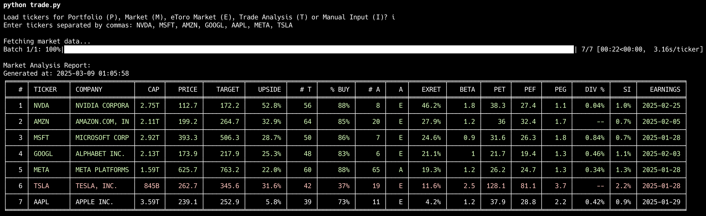

# etoroTRADE - Market Analysis & Portfolio Management Tool

A powerful Python-based analysis system that provides actionable trading recommendations for stocks, portfolios, and market intelligence using Yahoo Finance data. The tool features sophisticated rate limiting, intelligent caching, and multiple output formats to help you make informed investment decisions.



## What's This Tool For?

etoroTRADE helps you:
- **Analyze your portfolio** for potential sell candidates
- **Discover new buy opportunities** based on upside potential and analyst consensus
- **Monitor market conditions** across US, European, and Chinese markets
- **Track news sentiment** to stay ahead of market-moving events
- **Follow insider transactions** and institutional activity
- **Generate actionable trade recommendations** based on comprehensive criteria

## Trade.py - Main Application

The primary interface is `trade.py`, which provides several analysis options:

```bash
python trade.py
```

### Menu Options

- **P: Portfolio Analysis**
  - Analyzes your current holdings from portfolio.csv
  - Shows performance metrics, risk factors, and recommendations
  - Outputs to yahoofinance/output/portfolio.csv and console

- **M: Market Analysis**
  - Prompts for market selection (USA, Europe, China, or Manual)
  - Analyzes selected market for investment opportunities
  - Outputs to yahoofinance/output/market.csv and console

- **E: eToro Market Analysis**
  - Analyzes tickers available on eToro platform
  - Perfect for eToro users to find opportunities within available assets
  - Outputs to yahoofinance/output/market.csv and console

- **T: Trade Analysis**
  - Provides actionable trading recommendations with sub-options:
    - **B: Buy Opportunities** - New stocks to consider purchasing
    - **S: Sell Candidates** - Portfolio stocks to consider selling
    - **H: Hold Candidates** - Stocks with neutral outlook
  - Outputs to yahoofinance/output/buy.csv, sell.csv, or hold.csv

- **I: Manual Ticker Input**
  - Analyze specific tickers entered manually
  - Outputs to yahoofinance/output/manual.csv and console

## Trading Classification Criteria

The system uses these criteria to classify stocks into four categories:

### 🟡 INCONCLUSIVE
- Low confidence due to:
  - Less than 5 price targets OR
  - Less than 5 analyst ratings

### 🔴 SELL (Risk Management)
Triggered if ANY of these conditions are met:
- Less than 5% upside potential
- Less than 65% buy ratings from analysts
- Forward P/E (PEF) > Trailing P/E (PET) - deteriorating earnings outlook
- Forward P/E (PEF) > 45.0 (extremely high valuation)
- PEG ratio > 3.0 (overvalued relative to growth)
- Short Interest (SI) > 4% (high short interest)
- Beta > 3.0 (excessive volatility)
- Expected Return (EXRET) < 10.0 (insufficient potential return)

### 🟢 BUY (Growth Opportunity)
ALL of these conditions must be met:
- 20% or more upside potential
- 82% or more buy ratings from analysts
- Acceptable volatility (0.2 < Beta ≤ 3.0)
- Improving earnings outlook (PEF < PET) OR Negative trailing P/E
- Positive earnings projection (0.5 < PEF ≤ 45.0)
- Reasonable valuation relative to growth (PEG < 3.0)
- Acceptable short interest (SI ≤ 3%)

### ⚪ HOLD
- Stocks that pass confidence threshold
- Don't meet SELL criteria
- Don't meet BUY criteria

## Analysis Modules

### News & Market Intelligence
```bash
# News with sentiment analysis
python -m yahoofinance.analysis.news

# Economic indicators and metrics
python -m yahoofinance.analysis.metrics
```

### Performance Tracking
```bash
# Portfolio performance metrics
python -m yahoofinance.analysis.portfolio

# Market and portfolio performance tracking
python -m yahoofinance.analysis.performance
```

### Analyst & Earnings
```bash
# Analyst ratings and recommendations
python -m yahoofinance.analysis.analyst

# Upcoming earnings dates and surprises
python -m yahoofinance.analysis.earnings
```

### Insider Transactions
```bash
# Insider transactions analysis
python -m yahoofinance.analysis.insiders
```

## Setup Instructions

### Installation

```bash
# Clone the repository
git clone https://github.com/weirdapps/etorotrade
cd etorotrade

# Create and activate virtual environment
python -m venv myenv

# On Windows
myenv\Scripts\activate

# On macOS/Linux
source myenv/bin/activate

# Install dependencies
pip install -r requirements.txt
```

### Required Input Files

Create/modify these files in the yahoofinance/input/ directory:

1. **portfolio.csv** - Your current holdings
   ```
   symbol,shares,cost,date
   AAPL,10,150.25,2022-03-15
   MSFT,5,280.75,2022-04-20
   ```

2. **market.csv** - General market watchlist
   ```
   symbol,sector
   AAPL,Technology
   MSFT,Technology
   ```

3. **etoro.csv** - Tickers available on eToro (pre-populated)
4. **usa.csv**, **europe.csv**, **china.csv** - Regional ticker lists (pre-populated)
5. **notrade.csv** - Tickers to exclude from trading recommendations

## Project Structure

```
etorotrade/
├── CLAUDE.md             # Detailed technical documentation
├── LICENSE               # MIT License
├── README.md             # This file
├── assets/               # Application assets
│   └── etorotrade.png    # Screenshot
├── logs/                 # Log files directory
├── requirements.txt      # Python dependencies
├── scripts/              # Utility scripts
├── trade.py              # Main application entry point
├── yahoofinance/         # Core package
    ├── analysis/         # Analysis modules
    ├── api/              # Provider interfaces
    │   └── providers/    # Data providers
    ├── core/             # Core functionality
    ├── data/             # Data management
    ├── input/            # Input data files
    ├── output/           # Generated outputs
    ├── presentation/     # Display formatting
    └── utils/            # Utility modules
```

## Real-World Investment Performance

I personally use this script to power my eToro investment decisions. For real-world results and validation of this approach, you can follow or copy my eToro portfolio:

👉 [@plessas on eToro](https://www.etoro.com/people/plessas)

---

[](https://sonarcloud.io/summary/new_code?id=weirdapps_etorotrade)