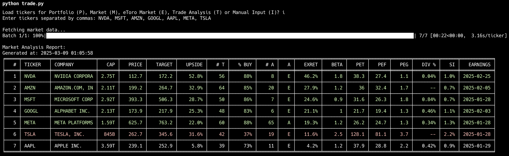
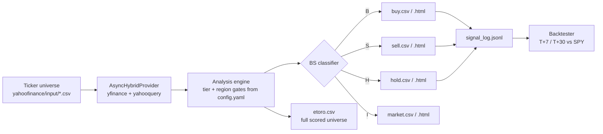
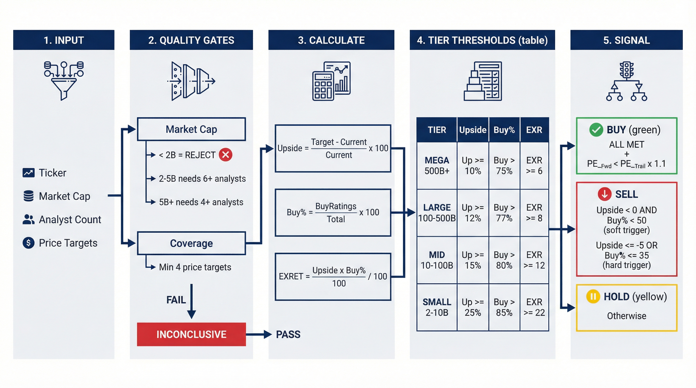

# etorotrade

Yahoo Finance analyst data, aggregated into BUY / SELL / HOLD signals for equities and ETFs, with position sizing and CSV+HTML reports.

[](https://github.com/weirdapps/etorotrade/actions/workflows/ci.yml)
[](https://github.com/weirdapps/etorotrade/actions/workflows/daily-signals.yml)
[](https://github.com/weirdapps/etorotrade/actions/workflows/codeql.yml)
[](https://sonarcloud.io/summary/new_code?id=weirdapps_etorotrade)
[](https://sonarcloud.io/summary/new_code?id=weirdapps_etorotrade)
[](LICENSE)
[](pyproject.toml)



> Created by [plessas](https://www.etoro.com/people/plessas), an eToro Popular Investor. This tool provides analysis only, not investment advice. Every investment decision is the user's own responsibility.

## What it is

`etorotrade` is a Python-based investment-signals engine. It pulls analyst consensus, price targets, and fundamentals from Yahoo Finance (`yfinance` + `yahooquery`), applies tier and region-specific thresholds from `config.yaml`, and writes color-coded reports to `yahoofinance/output/`.

The universe it scans is the ~12k tickers offered on eToro, plus your own portfolio. A full nightly pass runs on GitHub Actions in six parallel shards and commits the fresh CSVs back to the repo.

### Who it is for

- eToro users who want a systematic, second-opinion read on their positions.
- Retail investors who prefer analyst consensus + fundamentals over discretionary picks.
- Developers who want a reproducible, testable signal pipeline they can extend.

### What it is NOT

- Not investment advice, not a robo-advisor, not an automated trading system.
- Not a source of proprietary data. Everything downstream of Yahoo Finance.
- Not a promise of returns. Historical signal accuracy is measured by the built-in backtester, and results are advisory.

## Signal pipeline


```mermaid
flowchart LR
    A[Ticker universe<br/>yahoofinance/input/*.csv] --> B[AsyncHybridProvider<br/>yfinance + yahooquery]
    B --> C[Analysis engine<br/>tier + region gates from config.yaml]
    C --> D{BS classifier}
    D -->|B| E[buy.csv / .html]
    D -->|S| F[sell.csv / .html]
    D -->|H| G[hold.csv / .html]
    D -->|I| H[market.csv / .html]
    C --> I[etoro.csv<br/>full scored universe]
    E & F & G --> J[signal_log.jsonl]
    J --> K[Backtester<br/>T+7 / T+30 vs SPY]
```

## Quick start

### Prerequisites

Python 3.10, 3.11, or 3.12.

### Install

```bash
git clone https://github.com/weirdapps/etorotrade
cd etorotrade

# Create a venv and install the pinned, SHA256-hashed lockfile.
# Same install path CI uses. Poetry is NOT needed to install; only to change deps.
python3 -m venv venv && source venv/bin/activate
pip install --only-binary :all: --require-hashes -r requirements-dev-lock.txt
```

Or run `scripts/dev/setup.sh`, which does the same and also installs pre-commit hooks and copies `.env.example` to `.env`.

### Analyse your eToro portfolio

1. Export your positions from eToro (Portfolio, Export to CSV).
2. Save the file as `yahoofinance/input/portfolio.csv`. See `yahoofinance/input/portfolio.csv.example` for the schema.
3. Run:

```bash
python trade.py -o p
```

Results print to the console and land in `yahoofinance/output/portfolio.csv` and `portfolio.html`.

## Usage

`trade.py` is the single entry point. It runs interactively when called with no arguments, or takes an operation via `-o` and a target via `-t`.

```bash
python trade.py                      # interactive menu
python trade.py -o p                 # portfolio analysis
python trade.py -o p -t n            # portfolio, fetch fresh eToro data first
python trade.py -o m                 # market screening
python trade.py -o m -t 10           # market, first 10 tickers
python trade.py -o e                 # full eToro universe scan (~12k tickers)
python trade.py -o t -t b            # BUY opportunities (from etoro.csv, excludes holdings)
python trade.py -o t -t s            # SELL opportunities (portfolio holdings with S signal)
python trade.py -o t -t h            # HOLD opportunities (from etoro.csv, excludes holdings)
python trade.py -o i -t AAPL,MSFT    # ad-hoc analysis for specific tickers
python trade.py -o b                 # backtest signals (T+7 / T+30 forward validation)
python trade.py -o sc                # signal scorecard
python trade.py --validate-config    # validate config + exit
```

### Standalone analysis scripts

```bash
python scripts/analyze_geography.py       # ETF geographic-exposure decomposition
python scripts/analyze_industry.py        # sector-allocation analysis
python scripts/refresh_etoro_universe.py  # refresh the eToro ticker universe
python scripts/market_snapshot.py         # quick market snapshot
```

## Output

Reports are written to `yahoofinance/output/`:

| File | Content |
|---|---|
| `etoro.csv` / `.html` | Full scored eToro universe with `BS` signal per row |
| `portfolio.csv` / `.html` | Your current holdings, scored |
| `buy.csv` / `.html` | Non-holdings with a BUY signal, ranked by market cap |
| `sell.csv` / `.html` | Holdings with a SELL signal |
| `hold.csv` / `.html` | Non-holdings with a HOLD signal |
| `market.csv` / `.html` | Market screening pass |
| `manual.csv` / `.html` | Ad-hoc `-o i` runs |
| `backtest_*.csv/json` | Forward-validation results, vs SPY |
| `signal_log.jsonl` | Append-only signal history (input to the backtester) |

### CSV columns

The scored files share a common schema:

```text
TKR, NAME, CAP, PRC, TGT, UP%, #T, %B, #A, AM, A, EXR, B, 52W,
2H, PET, PEF, P/S, PEG, DV, SI, EG, PP, ROE, DE, FCF, ERN, SZ, BS,
SIGNAL_TRACK, SIGNAL_HORIZON
```

Key fields:

- `TKR` / `NAME` / `CAP`: ticker, company, market cap.
- `PRC` / `TGT` / `UP%`: current price, mean analyst target, implied upside.
- `#T` / `#A`: number of analyst targets and analysts.
- `%B` / `AM`: percent BUY consensus, analyst momentum.
- `EXR`: expected return (upside * buy% / 100).
- `PET` / `PEF` / `PEG` / `P/S`: valuation multiples.
- `DV` / `SI` / `EG` / `PP`: dividend, short interest, earnings growth, price performance.
- `ROE` / `DE` / `FCF`: return on equity, debt/equity, free-cash-flow yield.
- `ERN`: next earnings date.
- `SZ`: recommended position size (from `PositionSizer`).
- `BS`: the signal itself, one of `B`, `S`, `H`, `I` (INCONCLUSIVE).
- `SIGNAL_TRACK` / `SIGNAL_HORIZON`: metadata for the backtester.

## How the signal is computed

1. **Universe load**: tickers are read from `yahoofinance/input/etoro.csv`, `portfolio.csv`, or `market.csv` depending on operation.
2. **Data fetch**: `AsyncHybridProvider` calls yfinance for the bulk of fields and falls back to `yahooquery` for the fields yfinance drops (PEG, some fundamentals). Rate limiting and a disk cache sit in front.
3. **Tier + region gating**: each ticker is classified into one of five buckets. Cutoffs live in `config.yaml`:

    | Tier | Market cap |
    |---|---|
    | MEGA | >= $500B |
    | LARGE | $100B to $500B |
    | MID | $10B to $100B |
    | SMALL | $2B to $10B |
    | (below $2B) | Marked INCONCLUSIVE, hard floor |

    Universal analyst gates apply on top: $2B to $5B needs 6+ analysts, $5B and up needs 4+ (per-region tier blocks tighten further, e.g. US MEGA/LARGE/MID min_analysts: 8, HK MEGA: 15). Region blocks exist for US (baseline), EU (`.L`, `.PA`, `.AS`, `.DE`, `.MI`, etc.), and HK (`.HK`).

4. **Signal classification**: `BS` is set to `B`, `S`, `H`, or `I` based on the tier/region-specific `buy` and `sell` blocks in `config.yaml` (upside, buy%, PE, PEG, ROE, DE, beta, FCF yield, analyst momentum, and more).
5. **Position sizing**: `PositionSizer` in `trade_modules/trade_engine.py` produces `SZ` based on market-cap tier, expected return, and risk constraints.
6. **Persist**: results are written to CSV and HTML, and appended to `signal_log.jsonl` for backtesting.



## Configuration

### `config.yaml`

All thresholds live in a single ~1,000-line YAML file: tier gates, per-region `buy` and `sell` blocks, position-sizing parameters, calibration metadata. Parameters are calibrated quarterly against the T+7 / T+30 backtester and edited only by human review.

### Portfolio CSV schema

`yahoofinance/input/portfolio.csv` (mirror of the eToro export):

```csv
symbol,totalInvestmentPct,totalNetProfitPct,instrumentDisplayName
AAPL,5.2,12.5,Apple Inc
MSFT,4.8,8.3,Microsoft Corporation
```

### Environment variables

Optional. Copy `.env.example` to `.env`.

| Variable | Purpose |
|---|---|
| `ETORO_API_KEY`, `ETORO_USER_KEY`, `ETORO_USERNAME` | eToro Public API credentials, used by `scripts/refresh_etoro_universe.py` |
| `ALPHA_VANTAGE_API_KEY` | Alternative data provider |
| `POLYGON_API_KEY` | Alternative data provider |
| `NEWS_API_KEY` | News sentiment enrichment |
| `YFINANCE_MAX_CALLS` | Rate-limit override |
| `YFINANCE_CACHE_TTL` | Cache TTL override (seconds) |
| `YFINANCE_API_TIMEOUT` | Request timeout override |
| `YFINANCE_CIRCUIT_BREAKER_ENABLED` | `true` / `false` |
| `YAHOOFINANCE_LOG_LEVEL` | `DEBUG`, `INFO`, `WARNING`, etc. |
| `YAHOOFINANCE_DEBUG` | `true` enables debug logging |
| `SHARD_COUNT`, `SHARD_INDEX` | Universe sharding, used by the daily-signals workflow |

## Architecture

```text
trade.py                    # CLI entry point
trade_modules/              # Trading logic
  trade_cli.py              # argparse + async orchestration
  trade_engine.py           # TradingEngine, PositionSizer
  analysis_engine.py        # signal generation
  config_manager.py         # ConfigManager, ticker substitutions
  backtest_engine.py        # T+7 / T+30 forward validation
  signal_scorecard.py       # per-signal accuracy scorecard
  committee_*.py            # optional multi-agent research committee
  signals_v2/, riskfirst/   # next-gen signal pipeline (WIP)
yahoofinance/               # Data layer
  api/providers/            # AsyncHybridProvider, AsyncYahooFinance,
                            # AsyncYahooQuery, AlphaVantage, Polygon
  analysis/                 # StockAnalyzer, market filters, tiers
  core/                     # DI container, logging, errors, config
  utils/                    # trade criteria, async helpers, market utils
  presentation/             # console + HTML renderers
  input/                    # portfolio.csv, etoro.csv, region files
  output/                   # committed CSV + HTML reports
scripts/                    # standalone analysis + ops scripts
  dev/                      # setup.sh, test.sh, lint.sh, format.sh, relock.sh
config.yaml                 # buy/sell thresholds per tier/region
docs/                       # USER_GUIDE, TECHNICAL, POSITION_SIZING, CI_CD, FAQ
tests/                      # unit, integration, e2e, benchmarks
```

## Automation

Nine workflow files in `.github/workflows/`:

| Workflow | Schedule | Purpose |
|---|---|---|
| `ci.yml` | push, PR, nightly 02:00 UTC | Test matrix (3.10, 3.11, 3.12), bandit, safety, flake8, mypy, coverage, quality-gates, lockfile-sync, yfinance-compat smoke test |
| `codeql.yml` | push to master, PR, Mon 06:00 UTC | GitHub CodeQL static analysis |
| `sonarcloud.yml` | push, PR | Quality gate on SonarCloud (project `weirdapps_etorotrade`) |
| `daily-signals.yml` | daily 22:00 UTC | Full universe scan in 6 parallel shards, merges + commits `etoro.csv` and derived buy/sell/hold |
| `weekly-universe-refresh.yml` | Sun 21:00 UTC | Refreshes the ~12k-ticker universe from the eToro market-data API |
| `weekly-backtest.yml` | Sat 23:00 UTC | Runs T+7 / T+30 backtest pipeline and commits report |
| `deps-refresh.yml` | monthly, 4th at 04:17 UTC | Regenerates the lockfiles and opens a PR |
| `dependabot-relock.yml`, `dependabot-auto-merge.yml` | on Dependabot PRs | Auto-relock + auto-merge for green updates |

## Backtesting

There is a forward-validation backtester in `trade_modules/backtest_engine.py`. Since Yahoo Finance does not expose historical analyst recommendations, the engine uses `signal_log.jsonl` (accumulated by every run since January 2026) and compares each signal against actual price movements at T+7 and T+30 trading days.

```bash
python trade.py -o b
```

Output:

- Per-signal accuracy (BUY, SELL, HOLD).
- Tier and region breakdowns.
- Comparison against SPY as benchmark.
- Reports in `yahoofinance/output/backtest_*.csv` and `backtest_report.json`.

The `weekly-backtest.yml` workflow runs the same pipeline on GitHub Actions and commits the reports.

## Development

### Testing

```bash
pytest tests/                              # full suite
pytest tests/unit/                         # unit tests only (fast)
pytest tests/integration/                  # requires network
pytest -m "not slow"                       # skip slow tests
pytest --cov=yahoofinance --cov=trade_modules --cov-report=html
scripts/dev/test.sh                        # wrapper with coverage
```

CI runs the suite with `--cov-fail-under=58`.

### Linting and formatting

```bash
scripts/dev/lint.sh          # black --check + isort --check + flake8 + mypy
scripts/dev/format.sh        # black + isort auto-format
```

Line length: 100. Formatter: `black`. Import sort: `isort`. Linter: `flake8` + `ruff` (see `pyproject.toml`). Type checker: `mypy` runs in lenient mode and does not gate CI.

### Updating dependencies

The three `requirements-*-lock.txt` files (production, production+dev, production+smoketest) are all exported from `poetry.lock`, committed, and enforced by the `lockfile-sync` CI job. To bump a package:

```bash
# 1. Edit pyproject.toml
# 2. Regenerate all four lockfiles atomically
scripts/dev/relock.sh
# 3. Commit poetry.lock + requirements-*-lock.txt together
```

Poetry is only needed to *change* dependencies. Installing them uses pip directly with `--require-hashes`.

### Docker

A `Dockerfile` is provided for containerised runs.

## Documentation

- [User Guide](docs/USER_GUIDE.md): getting started, common workflows.
- [Technical Architecture](docs/TECHNICAL.md): system design, providers, DI.
- [Position Sizing](docs/POSITION_SIZING.md): the risk-adjusted sizing algorithm.
- [CI/CD](docs/CI_CD.md): pipeline stages, quality gates.
- [Examples](docs/EXAMPLES.md), [FAQ](docs/FAQ.md), [Troubleshooting](docs/TROUBLESHOOTING.md).
- [Evidence-based threshold changes](docs/EVIDENCE_BASED_THRESHOLD_CHANGES.md) and [Large/Mega threshold changes](docs/LARGE_MEGA_THRESHOLD_CHANGES.md): historical calibration decisions.

## Security

See [SECURITY.md](SECURITY.md). Do not open a public issue for a vulnerability; email `plessas@nbg.gr`.

## License

MIT, see [LICENSE](LICENSE).

## Disclaimer

This tool is designed for quantitative analysis and research. It does not constitute investment advice. Users should conduct their own due diligence and consider consulting a qualified financial advisor before making investment decisions. Past signal performance does not guarantee future results.
